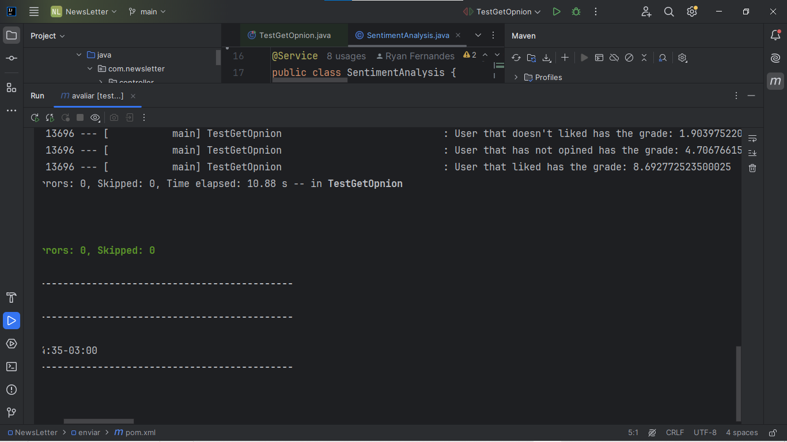
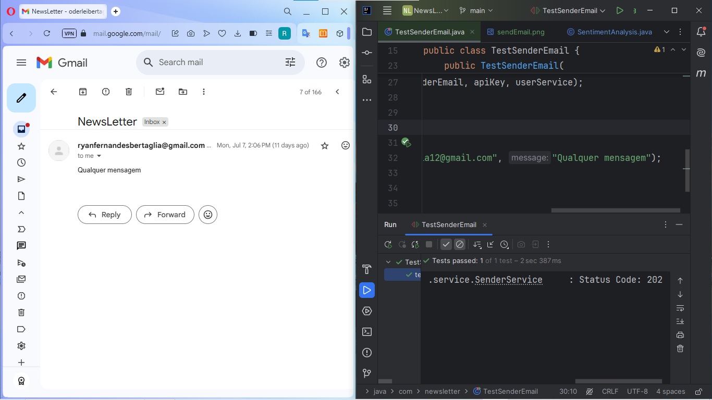
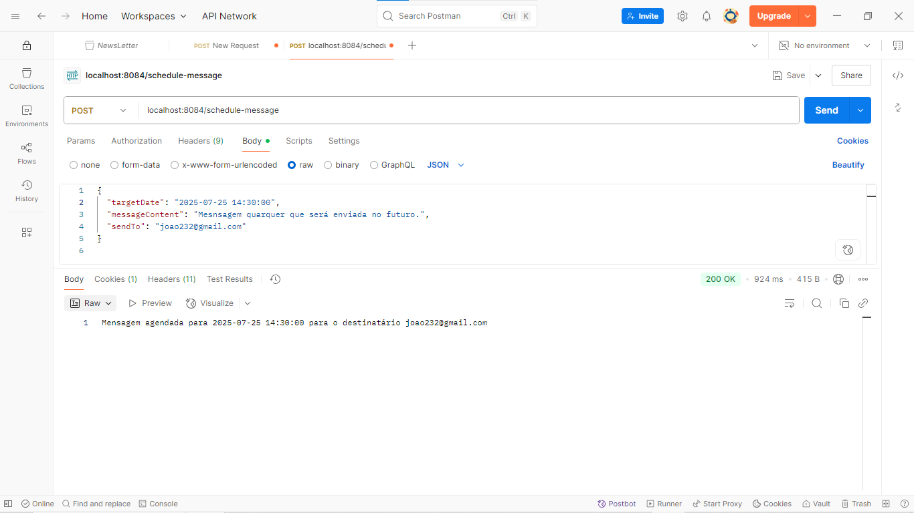

# Projeto NewsLetter

## Descrição:
Este projeto tem como objetivo criar uma newsletter funcional e escalável, utilizando o serviço de e-mail SendGrid para garantir o envio confiável das mensagens e a API do Stripe para gerenciar os pagamentos de forma segura e integrada

---
## Microserviços:
Para conseguir o máximo de controle sobre os componentes deste projeto separei as responsabilidades em microserviços, os quais são expostos ou se comunicam através da expose direto na rede (localhost), serviço de mensageria (RabbitMQ) ou sobre a camada de rede do docker-compose (bridge)

---
## Assim são os serviços e suas responsabilidades:

### Auth - Autenticação e Autorização

* Gerencia autenticação de usuários via protocolo OAuth2
* Gera tokens JWT personalizados
* Verifica e renova status de pagamento dos usuários
* Controla acesso aos recursos da aplicação

### Avaliar - Sistema de Avaliação Inteligente

* Recebe comentários dos usuários sobre versões de produtos
* Utiliza inteligência artificial para análise de sentimento 
* Atribui notas baseadas na análise do comentário
* Salva feedback do usuário no banco de dados
* Atualiza nota média da respectiva versão do produto

### Enviar - Processamento de E-mails

* Processa mensagens da fila do RabbitMQ
* Envia e-mails através do SendGrid
* Envio em broadcast: envia para todos os usuários com mensalidade em dia
* Envio direcionado: envia para e-mail específico

### Envio-conteúdo - Agendamento de Mensagens

* Recebe dados de mensagem, destinatário(s) e data de envio
* Subtrai a data atual pela data de envio e utilizada a diferença para determinar quanto tempo a mensagem vai ficar na fila de espera
* Após expiração do tempo, redireciona para fila de processamento

### Repercussão - Analytics e Relatórios

* Fornece dados sobre produtos e usuários
* Gerencia comentários dos produtos
* Identifica usuários com mais taxas de compartilhamentos

| route                                 | Entrada                        | description                                                         |
|---------------------------------------|--------------------------------|---------------------------------------------------------------------|
| <kbd>GET /getAverage/{version}</kbd>  | version (Path Variable, Long)  | retorna a média de avaliações para a versão do serviço especificada |
| <kbd>Get /getAverageOnDay</kbd>       | date (Request Body, LocalDate) | retorna a média diária de avaliações na data fornecida              |
| <kbd>Get /getAllMedias</kbd>          | —                              | retorna a lista completa de todas as avaliações                     |
| <kbd>Get /getShares</kbd>             | —                              | retorna a lista de compartilhamentos de usuários                    |
| <kbd>Get /getPostInfo/{version}</kbd> | version (Path Variable, Long)  | retorna detalhes de avaliação (RatingDetailsDTO) da versão informada|

---
## Tecnologias Utilizadas

* Java - Linguagem para criação microserviços backend
* React - Biblioteca JS para criação de interfaces
* OAuth2 Google - Protocolo de autenticação
* JWT - Tokens de acesso
* RabbitMQ - Sistema de filas
* SendGrid - Serviço de e-mail
* Inteligência Artificial (huggingface) - Análise de sentimento presente em comentários
* PostgreSQL - Banco de dados para users e feedback
* Stripe - API de pagamentos para compra do serviço
